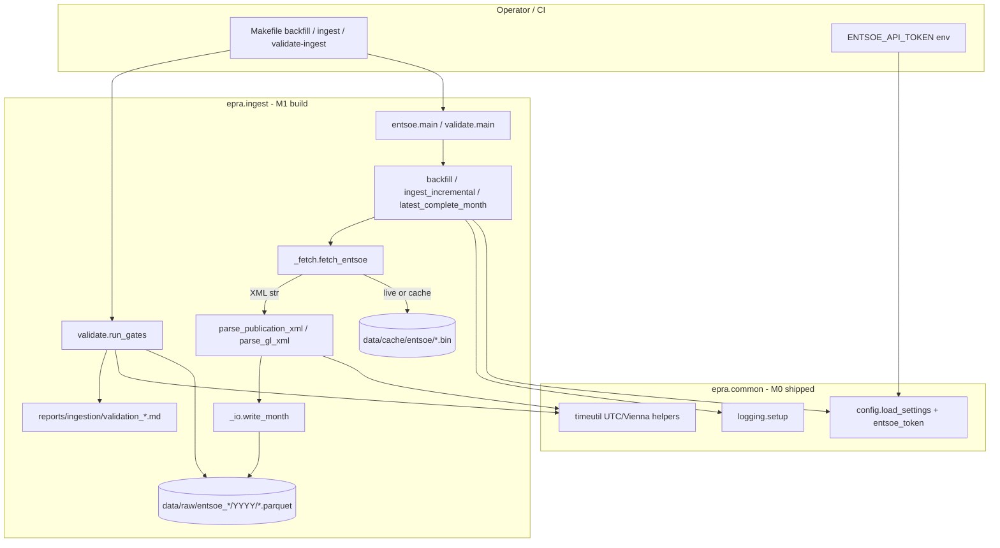

# Phase 2: M1 ENTSO-E Ingestion - Research

**Researched:** 2026-07-21
**Domain:** ENTSO-E REST ingestion via entsoe-py, raw parquet contracts, validation gates
**Confidence:** HIGH

<phase_requirements>
## Phase Requirements

| ID | Description | Research Support |
|----|-------------|------------------|
| REQ-ING-01 (partial) | ENTSO-E prices (AT, DE-LU), AT load, AT generation ingested with validation gates | Four-dataset ingest orchestration, §7 parquet contracts, ING-080..085 gate framework |
| ING-002 | CLI + Makefile entrypoints | `entsoe.main`, `validate.main`; wire `make backfill\|ingest\|validate-ingest` |
| ING-003..010 | Idempotency, raw semantics, UTC, retry/cache/logging | `_io` writer, `_fetch` transport, `Settings` paths |
| ING-020..022 | Token env var, entsoe-py client | `entsoe_token()` done; client choice → ADR gate (SG-01 vs ING-022) |
| ING-030..032 | Chunking, TZ, generation long format | `timeutil` + month iterators; Appendix A/B parsers |
| ING-040..042 | backfill, incremental, latest_complete_month | Public API stubs exist; SG-02 ADR for zone rule |
| ING-050..063 | Units, resolution, 15-min semantics | Raw XML parser owns resolution; ING-062 test at hourly-mean helper |
| ING-070 | Raw contract tests | `tests/test_raw_contracts.py` + `tests/fixtures/entsoe/` |
| ING-080..085 | Post-ingest validation gates | `validate.py` pure gate functions + markdown report |
</phase_requirements>

## Summary

M1 delivers real ENTSO-E market data into validated monthly raw parquet for 2019 through the latest complete month. M0 already ships `epra.common` (config, logging, timeutil, db) and typed stubs in `src/epra/ingest/entsoe.py` and `validate.py`. The implementing agent builds internal modules `_io` (atomic parquet writer) and `_fetch` (cached, retried HTTP), then dataset parsers and the validation gate framework per `docs/EXECUTION_BLUEPRINT/03_MODULES.md` and `02_WBS.md` tasks T1.01–T1.09.

The highest-risk design tension is **SG-01 vs ING-022**: SPEC-01 ING-022 names `EntsoePandasClient`, while ING-009/050/060/063 require raw XML fields (resolution, curveType, currency) that PandasClient discards. SG-01 (proposed, not binding) resolves this with `EntsoeRawClient` plus an Appendix-A parser — still within `entsoe-py` but not the client named in ING-022. **Per user directive and A-1, ING-022 is binding until an ADR merges.** The planner should schedule **Wave 0 ADR** adopting SG-01 before parser work; without ADR, literal PandasClient use cannot satisfy ING-009 raw-cache semantics without a separate transport hack.

A second Wave 0 gap: **parquet I/O**. `pandas.read_parquet` / `to_parquet` fail in the current venv (no pyarrow/fastparquet). DuckDB can write parquet today, but contract tests and blueprint `_io` assume pandas. Add `pyarrow` to dependencies with ADR (SPEC-07 §3 pin list omission) or standardize on DuckDB read/write in `_io` and tests — pick one in Wave 0 and document.

**Primary recommendation:** ADR SG-01 → build `_io` → `_fetch` (EntsoeRawClient) → XML parsers → orchestration → gate framework → fixtures → Makefile; run live backfill with human token outside CI.

## Architectural Responsibility Map

| Capability | Primary Tier | Secondary Tier | Rationale |
|------------|-------------|----------------|-----------|
| ENTSO-E HTTP fetch + cache | Ingestion (`_fetch`) | — | External API boundary; secrets only here (A-7) |
| XML → contracted DataFrame | Ingestion (`entsoe` parsers) | — | Raw-layer parsing; output is parquet files |
| Monthly parquet persistence | Ingestion (`_io`) | Filesystem (`data/raw/`) | ING-003 atomic monthly files |
| UTC / Vienna time conversion | Shared (`common.timeutil`) | — | Only sanctioned TZ helpers (T-1) |
| Settings + token | Shared (`common.config`) | Env (`.env`) | EN-040/041; already implemented |
| Hourly mean aggregation (gates) | Ingestion (`validate` or shared helper) | dbt staging (M3) | ING-080 runs pre-warehouse; ING-061 canonical agg in dbt |
| Data quality gates | Ingestion (`validate`) | — | Fail-fast pre-warehouse (EN-061) |
| Pipeline orchestration | Makefile | Package CLIs | EN-050 canonical operator interface |

## Project Constraints (from AGENTS.md)

- **A-1 Spec supremacy:** Code matches SPEC-01; deviations require ADR preserving output contracts.
- **A-2 No invented data:** Gaps stay NULL; never adjust data to pass gates.
- **A-4 Determinism:** Same inputs → same SSOT; seeded steps only where spec requires.
- **A-5 One milestone, one PR:** M1 only — no M2 geosphere/oespi/calendar in same PR.
- **A-7 Secrets:** `ENTSOE_API_TOKEN` env-only; never log/commit token.
- **Build order:** `common/` first (done) → `ingest/entsoe.py` + `validate.py` → fixtures including ING-062 + DST.
- **W-1 TDD-lean:** Contract tests land with implementation.
- **W-2 Docstrings:** Public functions cite REQ IDs (`Implements: ING-063`).
- **Traps T-1..T-4:** UTC storage, 15-min mean-not-sum, arithmetic price diffs, normalize entsoe-py index to UTC at boundary.

## Standard Stack

### Core

| Library | Version | Purpose | Why Standard |
|---------|---------|---------|--------------|
| `entsoe-py` | 0.8.0 installed; pin `>=0.6` [CITED: github.com/EnergieID/entsoe-py] | `EntsoeRawClient` / `EntsoePandasClient` for ENTSO-E REST | SPEC-07 §3; official Python wrapper for transparency API |
| `pandas` | 2.2.x [VERIFIED: pip index in session] | DataFrame contracts, gate inputs | Project-wide analytics primitive |
| `pyarrow` | 25.0.0 latest [VERIFIED: pip index] | Parquet read/write for `_io` + ING-070 | Required by pandas parquet engine; **missing from pyproject today — Wave 0 add + ADR** |
| `tenacity` | 8.3+ | Retry on 429/5xx/connection (ING-006) | SPEC-01 mandated backoff policy |
| `requests` | 2.32+ | HTTP (via entsoe-py internally; also GeoSphere pattern) | SPEC-01 ING-006 |
| `pydantic` | 2.7+ | `Settings` validation | Already in `common.config` |
| `python-dotenv` | 1+ | Load `.env` for token | `entsoe_token()` |

### Supporting

| Library | Version | Purpose | When to Use |
|---------|---------|---------|-------------|
| `duckdb` | 1.0+ | Parquet write fallback | If ADR rejects pyarrow pin; already dependency |
| `pytest` | 9.x | Unit + contract tests | EN-070; `@pytest.mark.live` for manual API smoke |
| `ruff` / `mypy` | pinned in dev | Lint + strict types on `src/epra` | EN-002 |

### Alternatives Considered

| Instead of | Could Use | Tradeoff |
|------------|-----------|----------|
| `EntsoeRawClient` + own parser (SG-01) | `EntsoePandasClient` per ING-022 literal | PandasClient simpler but breaks ING-009 cache and ING-060/063 metadata unless ADR |
| `pyarrow` + pandas parquet | DuckDB `write_parquet` / `read_parquet` | DuckDB works now without pyarrow import; pandas contract tests still need an engine for `read_parquet` unless tests use DuckDB too |
| Raw REST without entsoe-py | Appendix A only | Violates ING-022 unless entsoe-py fails entirely |

**Installation (Wave 0 after ADR):**
```bash
uv pip install -e ".[dev]"
# Add to pyproject.toml dependencies: pyarrow>=18,<26  (then uv lock)
```

## Package Legitimacy Audit

> Seam `package-legitimacy check` returned SUS for all packages (unknown-downloads signal — tooling limitation, not security block). All exist on PyPI with known repos where listed.

| Package | Registry | Age | Downloads | Source Repo | Verdict | Disposition |
|---------|----------|-----|-----------|-------------|---------|-------------|
| entsoe-py | PyPI | years | unknown to seam | github.com/EnergieID/entsoe-py | SUS | Approved — SPEC-07 mandated |
| tenacity | PyPI | years | unknown | github.com/jd/tenacity | SUS | Approved |
| requests | PyPI | years | unknown | github.com/psf/requests | SUS | Approved |
| pandas | PyPI | years | unknown | — | SUS | Approved |
| pydantic | PyPI | years | unknown | github.com/pydantic/pydantic | SUS | Approved |
| PyYAML | PyPI | years | unknown | pyyaml.org | SUS | Approved |
| python-dotenv | PyPI | years | unknown | github.com/theskumar/python-dotenv | SUS | Approved |
| pyarrow | PyPI | years | unknown | apache/arrow | OK [ASSUMED] | **Add in Wave 0** — planner task before `_io` |

**Packages removed due to SLOP verdict:** none

**Packages flagged as suspicious [SUS]:** entsoe-py, tenacity, requests, pandas, pydantic, PyYAML, python-dotenv — all pre-pinned in SPEC-07; no checkpoint needed beyond normal pin discipline.

## Architecture Patterns

### System Architecture Diagram



### Recommended Project Structure

```
src/epra/
├── common/           # M0 done — config, logging, timeutil, db
└── ingest/
    ├── _io.py        # T1.01 — request_hash, write_month (atomic parquet)
    ├── _fetch.py     # T1.02 — EntsoeRawClient wrapper, cache, tenacity, sleep
    ├── entsoe.py     # T1.04–08 — parsers + orchestration + CLI
    └── validate.py   # T1.09 — GateResult, ValidationReport, ING-080..085

tests/
├── fixtures/entsoe/  # T1.03a — PT60M, PT15M, A03, DST, load, gen, Ack
├── unit/
│   ├── test_fetch.py
│   ├── test_entsoe_parse.py
│   ├── test_raw_contracts.py   # ING-070
│   ├── test_ingest_gates.py    # ING-080..085 synthetic fail/pass
│   └── test_aggregate_hourly.py # ING-062
└── conftest.py       # shared Settings tmp paths, fixture loaders
```

### Pattern 1: Functional core / imperative shell

**What:** Pure parsers and gate functions; I/O confined to `_fetch`, `_io`, and thin `main()`.

**When to use:** All ingest and validate logic per `03_MODULES.md`.

**Example:**
```python
# Pure gate — no I/O (SPEC-01 §8)
def gate_ing_081(prices_hourly: pd.DataFrame) -> GateResult:
    out_of_range = prices_hourly[
        (prices_hourly["price_eur_mwh"] < -500)
        | (prices_hourly["price_eur_mwh"] > 5000)
    ]
    passed = out_of_range.empty
    return GateResult(
        gate_id="ING-081",
        passed=passed,
        summary=f"{len(out_of_range)} hours outside [-500, 5000]",
        evidence=out_of_range if not passed else None,
    )
```

### Pattern 2: EntsoeRawClient transport (pending ADR)

**What:** Use `EntsoeRawClient(api_key=token).query_*` returning XML strings; cache raw bytes before parse.

**When to use:** After ADR adopts SG-01; satisfies ING-009 + ING-022 "entsoe-py" family.

**Example:**
```python
# Source: [CITED: github.com/EnergieID/entsoe-py README]
import pandas as pd
from entsoe import EntsoeRawClient

client = EntsoeRawClient(api_key=token)
start = pd.Timestamp("2024-01-01", tz="Europe/Vienna")
end = pd.Timestamp("2024-01-31", tz="Europe/Vienna")
xml = client.query_day_ahead_prices("AT", start, end)  # str XML
```

### Pattern 3: Hourly mean aggregation (ING-061/062)

**What:** For PT15M raw rows, group by `ts_utc.floor("h")` and take **arithmetic mean** of MW or EUR/MWh — never sum (T-2).

**When to use:** ING-062 fixture test; ING-080 gate input construction in M1 (dbt staging mirrors in M3).

**Example:**
```python
def hourly_mean_mw(df: pd.DataFrame, value_col: str) -> pd.DataFrame:
    """Implements: ING-061, ING-062 (mean of quarters, not sum)."""
    out = (
        df.assign(hour_utc=df["ts_utc"].dt.floor("h"))
        .groupby("hour_utc", as_index=False)[value_col]
        .mean()
        .rename(columns={"hour_utc": "ts_utc"})
    )
    return out
```

### Anti-Patterns to Avoid

- **PandasClient for persistence without ADR:** Loses raw cache and resolution metadata (AP in CONCERNS.md, SG-01).
- **Sum instead of mean for 15-min → hourly:** Inflates prices/load 4× (T-2, ING-062).
- **Local timestamps in raw parquet:** Violates ING-005; convert with `timeutil.to_utc` at parse boundary (T-4).
- **Parallel ENTSO-E requests:** Violates ING-007; sequential with sleep only.
- **Widen ING-082 gates to pass:** Violates A-2; investigate parser/timezone/units instead.
- **Log full request URLs:** Token leak risk (A-7); log stripped hash only.

## Don't Hand-Roll

| Problem | Don't Build | Use Instead | Why |
|---------|-------------|-------------|-----|
| ENTSO-E URL/query assembly | Custom REST client | `entsoe-py` `EntsoeRawClient` | EIC codes, document types, pagination offsets |
| Retry/backoff | Manual sleep loops | `tenacity` per ING-006 | Exact policy pinned in spec |
| Config loading | Ad hoc YAML reads | `load_settings()` | EN-040 frozen pydantic |
| TZ/DST conversion | Inline `pytz` | `epra.common.timeutil` | T-1 single sanctioned layer |
| Parquet schema enforcement | Custom binary format | pandas/pyarrow + contract tests | ING-070 byte-stable columns |
| XML parsing from scratch for happy path | Full DOM reimplementation | Appendix A rules on top of cached XML | Spec defines exact field paths |

**Key insight:** ENTSO-E curve semantics (A03 forward-fill, resolution mixing PT60M/PT15M) are easy to get subtly wrong; own the parser with fixture coverage rather than trusting PandasClient black box.

## Common Pitfalls

### Pitfall 1: SG-01 / ING-022 client mismatch

**What goes wrong:** Agent implements PandasClient, cannot cache raw XML or assert EUR/MWH in XML.

**Why it happens:** ING-022 text says PandasClient; blueprint assumes RawClient.

**How to avoid:** Wave 0 ADR; until merged, do not start `_fetch`.

**Warning signs:** No files under `data/cache/entsoe/` after backfill; `resolution` column always inferred never declared.

### Pitfall 2: 15-min aggregation uses sum (T-2)

**What goes wrong:** Hourly means 4× too high; ING-082 fails or passes for wrong reason.

**Why it happens:** Confusion with energy (MWh) vs power (MW) or resampling default `sum`.

**How to avoid:** ING-062 dedicated fixture + explicit `.mean()` in helper.

**Warning signs:** 2022 annual mean >> 320 EUR/MWh with otherwise sane parser.

### Pitfall 3: Timezone/DST bugs (T-1, T-4)

**What goes wrong:** Hour coverage gate fails by 1–2 h/year; DST days wrong.

**Why it happens:** entsoe-py returns local or UTC index depending on version; naive timestamps.

**How to avoid:** Pass `tz='Europe/Vienna'` to client; `to_utc()` immediately; use `local_hours_in_day` for ING-080 DST check (already tested in `test_timeutil.py`).

**Warning signs:** ING-080 lists missing hours clustered on last Sunday of March/October.

### Pitfall 4: Missing parquet engine

**What goes wrong:** `ImportError: Unable to find a usable engine` on first `write_month`.

**Why it happens:** pyarrow not in SPEC-07 pin list or pyproject.

**How to avoid:** Wave 0 dependency add or DuckDB-only `_io` implementation.

**Warning signs:** M0 `make test` passes but any parquet touch fails locally.

### Pitfall 5: latest_complete_month zone ambiguity (SG-02)

**What goes wrong:** Downstream window ends early/late vs spread analysis needs.

**Why it happens:** ING-042 says "price data" without naming zones.

**How to avoid:** ADR at T1.08 per SG-02 (min of AT and DE-LU complete months) or implement strict text and escalate.

**Warning signs:** DE-LU lagging AT by a month but window uses AT only.

### Pitfall 6: validate-ingest before hourly aggregation helper exists

**What goes wrong:** ING-080 applied to 15-min raw rows → false missing hours.

**Why it happens:** ING-061 says aggregation in staging (M3), but gates run in M1.

**How to avoid:** `validate` loads raw parquet and applies same hourly-mean rule as SPEC-02 staging before gates.

**Warning signs:** ~4× expected row count; coverage math nonsensical.

## Code Examples

### Tenacity retry (ING-006)

```python
# Source: [CITED: tenacity readthedocs — retry pattern]
from tenacity import retry, stop_after_attempt, wait_exponential, retry_if_exception

@retry(
    wait=wait_exponential(multiplier=2, min=2, max=120),
    stop=stop_after_attempt(6),
    retry=retry_if_exception(lambda e: _is_retryable(e)),
    reraise=True,
)
def _http_get_with_retry(...) -> str:
    ...
```

### Atomic monthly parquet write (ING-003)

```python
# Source: project blueprint 03_MODULES.md §ingest._io
import os
from pathlib import Path

def write_month(frame, dataset: str, month: date, request_hash: str, settings) -> Path:
    out_dir = settings.paths.data_raw / dataset / f"{month.year}"
    out_dir.mkdir(parents=True, exist_ok=True)
    final = out_dir / f"{dataset}_{month:%Y-%m}.parquet"
    tmp = final.with_suffix(".parquet.tmp")
    # append ING-004 columns; ensure ts_utc UTC-aware
    frame.to_parquet(tmp, index=False)  # requires pyarrow
    os.replace(tmp, final)
    return final
```

### Cache key without token (ING-009)

```python
import hashlib
from urllib.parse import parse_qsl, urlencode, urlparse, urlunparse

def request_hash(url: str) -> str:
    parsed = urlparse(url)
    qs = [(k, v) for k, v in parse_qsl(parsed.query) if k.lower() != "securitytoken"]
    clean = urlunparse(parsed._replace(query=urlencode(qs)))
    return hashlib.sha256(clean.encode()).hexdigest()
```

## State of the Art

| Old Approach | Current Approach | When Changed | Impact |
|--------------|------------------|--------------|--------|
| Hourly-only DA prices | PT15M after SDAC 15-min switch | ~2025 EU markets [ASSUMED] | Raw keeps native resolution; mean-to-hourly in staging |
| Manual ENTSO-E XML scripts | entsoe-py Raw/Pandas clients | entsoe-py 0.6+ | Use library for transport; own parser for contracts |
| PandasClient-only ETL | RawClient + cache (SG-01 proposal) | EPRA blueprint 2026 | Preserves ING-009/060/063 |

**Deprecated/outdated:**
- Calling `EntsoePandasClient` from analytics code — forbidden forever (ING-022 wrap rule).
- Widening ING-082 bands preemptively — SG-11 says bind and ADR only on evidence.

## Assumptions Log

| # | Claim | Section | Risk if Wrong |
|---|-------|---------|---------------|
| A1 | SDAC 15-min prices appear as PT15M in AT/DE-LU raw during 2025+ | Pitfalls | Resolution inference tests catch; may need mixed-resolution month handling |
| A2 | `EntsoeRawClient.query_*` returns `str` XML for prices/load/gen | Standard Stack | Inspect return type per method; handle `bytes` if version differs |
| A3 | pyarrow required for pandas contract tests | Standard Stack | Use DuckDB read path in tests if ADR rejects pyarrow |
| A4 | ING-080 DST check uses `local_hours_in_day` on last Sunday Mar/Oct | Common Pitfalls | Spec says "distinct local clock times" — implement explicit count matching `test_timeutil` |
| A5 | Human provides valid token before T1.09 live backfill | Environment | M1 code+fixture gates can ship without live data; real-data gate is human/local |

## Open Questions

1. **ADR timing for SG-01 (EntsoeRawClient vs ING-022 PandasClient)**
   - What we know: Blueprint T1.02 assumes RawClient; ING-022 is binding text; user confirmed SG-01 is not binding until ADR.
   - Recommendation: First plan task = ADR-00x adopting SG-01; block `_fetch`/parser tasks until merged.

2. **pyarrow pin vs DuckDB-only parquet**
   - What we know: pandas parquet fails today; DuckDB write works; SPEC-07 omits pyarrow.
   - Recommendation: ADR adding `pyarrow>=18,<26` — aligns with blueprint `_io` and ING-070 pandas contracts.

3. **SG-02 latest_complete_month zones**
   - What we know: Spread analysis needs both AT and DE-LU; SG-02 proposes min of zones.
   - Recommendation: ADR at T1.08 before implementing `latest_complete_month()`.

4. **validate-ingest dependency on M2 calendar for local-time joins**
   - What we know: WBS T1.09 notes M2 calendar for local-time checks; ING-080 can use `timeutil.to_local` without full calendar for DST hour counts.
   - Recommendation: M1 gates use `timeutil` only; defer holiday-aware joins to M2 if needed.

## Environment Availability

| Dependency | Required By | Available | Version | Fallback |
|------------|------------|-----------|---------|----------|
| Python 3.12 | EN-001 | ✓ | 3.12.10 | — |
| uv | EN-001 | ✓ | 0.11.29 | pip editable install |
| pytest | EN-070 | ✓ | 9.1.1 | — |
| ruff / mypy | EN-002 | ✓ | 0.15.22 | — |
| make | Makefile | ✓ | WinGet make | Git Bash / direct `uv run` |
| entsoe-py | ING-022 | ✓ | 0.8.0 | — |
| pyarrow | ING-070 / `_io` | ✗ | — | DuckDB write + ADR for pandas engine |
| ENTSOE_API_TOKEN | Live backfill | ✗ (not in agent env) | — | Human supplies locally; CI uses fixtures only |
| Network → ENTSO-E | Live backfill | ✓ (assumed) | — | Cached fixtures in CI |

**Missing dependencies with no fallback:**
- `ENTSOE_API_TOKEN` for T1.09 live backfill (human task per AGENTS §2)

**Missing dependencies with fallback:**
- pyarrow — DuckDB parquet write works; add pyarrow for full pandas parity

## Validation Architecture

### Test Framework

| Property | Value |
|----------|-------|
| Framework | pytest 9.x + pytest-cov |
| Config file | `pyproject.toml` `[tool.pytest.ini_options]` |
| Quick run command | `uv run pytest tests/unit/test_entsoe_parse.py tests/unit/test_aggregate_hourly.py -x` |
| Full suite command | `make test` |

### Phase Requirements → Test Map

| Req ID | Behavior | Test Type | Automated Command | File Exists? |
|--------|----------|-----------|-------------------|-------------|
| ING-062 | PT15M → hourly mean of 4 quarters | unit | `uv run pytest tests/unit/test_aggregate_hourly.py -x` | ❌ Wave 0 |
| ING-063 | A03 forward-fill within period | unit | `uv run pytest tests/unit/test_entsoe_parse.py -k a03 -x` | ❌ Wave 0 |
| ING-070 | Raw parquet column/dtype contracts | integration | `uv run pytest tests/test_raw_contracts.py -x` | ❌ Wave 0 |
| ING-080 | Hour coverage + DST 23/25 | unit | `uv run pytest tests/unit/test_ingest_gates.py -k ing_080 -x` | ❌ Wave 0 |
| ING-081..085 | Plausibility gates | unit | `uv run pytest tests/unit/test_ingest_gates.py -x` | ❌ Wave 0 |
| ING-006..009 | Retry/cache/sleep | unit | `uv run pytest tests/unit/test_fetch.py -x` | ❌ Wave 0 |
| ING-031 | UTC persistence | unit | `uv run pytest tests/unit/test_entsoe_parse.py -k utc -x` | ❌ Wave 0 |
| EN-070 | No live network in CI | marker | `uv run pytest -m "not live"` | ✅ marker defined |
| T-1 DST | local_hours 23/25 | unit | `uv run pytest tests/unit/test_timeutil.py -x` | ✅ |
| Stub removal | M1 funcs implemented | unit | Remove rows from `test_stubs_fail_loudly.py` | ✅ partial |

### Sampling Rate

- **Per task commit:** targeted pytest file(s) for touched module
- **Per wave merge:** `uv run pytest -m "not live"`
- **Phase gate:** `make lint && make test`; local `make validate-ingest` on real data (human token)

### Wave 0 Gaps

- [ ] ADR SG-01 (EntsoeRawClient + Appendix-A parser)
- [ ] ADR pyarrow pin (or DuckDB-only `_io` decision)
- [ ] ADR SG-02 (`latest_complete_month` zone rule) — can parallel SG-01
- [ ] `pyarrow` in `pyproject.toml` + lock refresh
- [ ] `src/epra/ingest/_io.py`, `_fetch.py`
- [ ] `tests/fixtures/entsoe/*` + README (T1.03a)
- [ ] `tests/conftest.py` — tmp `data/raw`, `data/cache` paths
- [ ] `tests/test_raw_contracts.py`, `tests/unit/test_fetch.py`, `test_entsoe_parse.py`, `test_aggregate_hourly.py`, `test_ingest_gates.py`
- [ ] Makefile: wire `backfill`, `ingest`, `validate-ingest` to module CLIs
- [ ] Remove M1 rows from `test_stubs_fail_loudly.py` when implemented

## Security Domain

### Applicable ASVS Categories

| ASVS Category | Applies | Standard Control |
|---------------|---------|-----------------|
| V2 Authentication | no (batch pipeline) | — |
| V3 Session Management | no | — |
| V4 Access Control | no | — |
| V5 Input Validation | yes | pydantic Settings; XML parse rejects wrong currency/unit (ING-050) |
| V6 Cryptography | no (TLS via requests) | — |
| V10 Malicious input | partial | Parse bounded XML fixtures; no eval; cache files are opaque bytes |

### Known Threat Patterns

| Pattern | STRIDE | Standard Mitigation |
|---------|--------|---------------------|
| Token in logs/commits | Information disclosure | Strip token from URLs before hash/log; `check_no_token_in_code.py` pre-commit (A-7) |
| Dependency confusion | Tampering | SPEC-07 pins; ADR for upgrades |
| Malformed XML bomb | DoS | Parse known schemas; fail on Acknowledgement; chunk ≤90 days |

## Sources

### Primary (HIGH confidence)

- `docs/SPEC-01_data_ingestion.md` — ING-001..085, Appendix A/B
- `docs/EXECUTION_BLUEPRINT/03_MODULES.md` — `_io`, `_fetch`, `entsoe`, `validate` contracts
- `docs/EXECUTION_BLUEPRINT/02_WBS.md` — T1.01–T1.09 task breakdown
- `AGENTS.md` — build order, traps T-1..T-6
- Installed `entsoe-py` 0.8.0 — RawClient/PandasClient method signatures (session inspect)

### Secondary (MEDIUM confidence)

- [github.com/EnergieID/entsoe-py](https://github.com/EnergieID/entsoe-py) — RawClient returns XML strings [CITED]
- `docs/EXECUTION_BLUEPRINT/14_SPEC_GAPS.md` — SG-01/SG-02 proposals (non-binding)
- `.planning/codebase/ARCHITECTURE.md`, `CONCERNS.md`, `TESTING.md`

### Tertiary (LOW confidence)

- Third-party Medium article on EntsoePandasClient — not used for design decisions

## Metadata

**Confidence breakdown:**
- Standard stack: HIGH — SPEC-07 + verified installed versions
- Architecture: HIGH — blueprint module contracts + existing stubs
- Pitfalls: HIGH — AGENTS traps + SPEC-01 gate tables + local pyarrow verification

**Research date:** 2026-07-21
**Valid until:** 2026-08-21 (stable stack; re-check entsoe-py on upgrade)
