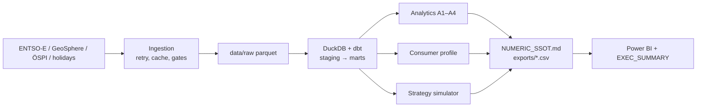

# Energy Procurement Risk Analyzer (EPRA)



[](https://github.com/RafaelBraga-Kribitz/energy-procurement-risk-analyzer/actions/workflows/ci.yml)
[](https://www.python.org/downloads/release/python-3120/)
[](LICENSE)
[](#status)

**Status:** Foundation

After the 2021–2023 European energy crisis, electricity procurement became a board-level
risk for Austrian industry. This project quantifies that risk on the Austrian day-ahead
market (ENTSO-E) for a 50 GWh Styrian industrial consumer — full spot vs. indexed contract
vs. fixed annual price vs. partial hedge.

> **How much did buying electricity the wrong way cost a 50 GWh/year Styrian
> manufacturer in 2021–2025 — and what is the P95 cost exposure for the next
> 12 months under each procurement strategy?**

## Project status

Foundation: charter and eight SPECs are final. M0 (bootstrap), M1 (ENTSO-E ingest),
M2 (GeoSphere, ÖSPI, calendar), and M3 (DuckDB + dbt warehouse) are implemented.
M4–M7 — consumer profile, market analytics, strategy simulator, and reporting — are
not yet implemented. `make profile`, `make analyze`, `make simulate`, and `make ssot`
still fail loudly with their milestone.

**No results yet.** Per project rule (RP-601 / GV-303), every number in this README
is copied from the auto-generated `reports/NUMERIC_SSOT.md` (generated at M6; not yet in the repository)
with its epistemic tag. No results exist yet, so none are quoted yet. The answer
lands here at M6/M7. There is no result chart to embed; the pipeline diagram above
is the primary evidence until SSOT numbers exist.

## Explore this project

| Audience | Start here |
|---|---|
| Recruiter | This page: the question, foundation [Status](#status), and pipeline diagram |
| Hiring manager | [PROJECT_CHARTER.md](PROJECT_CHARTER.md) §1 (question + four strategies) and [LIMITATIONS.md](LIMITATIONS.md) |
| Technical reviewer | [Architecture](#architecture), [Method](#method), [docs/SPEC-01](docs/SPEC-01_data_ingestion.md) through [SPEC-05](docs/SPEC-05_strategy_simulator.md) |
| Auditor | [Data](#data), [Validation](#validation), [docs/SPEC-08](docs/SPEC-08_governance_quality.md), [docs/ADR/](docs/ADR/) |

## Method

Question → evidence → assumptions → model → uncertainty → decision.

1. **Question.** Four strategies on one constructed 50 GWh Styrian load: what did each
   cost in 2021–2025, and what is next-12-month P95 / CVaR95 (SPEC-05).
2. **Evidence.** Real Austrian day-ahead prices, load, and generation from ENTSO-E;
   ÖSPI monthly index (hand-transcribed, double-entry); Graz daily temperature; Austrian
   / Styrian holidays. No synthetic market prices.
3. **Assumptions.** Load shape is constructed, not measured (CALIBRATED). ÖSPI proxies
   contract / forward prices (R-5). Grid fees, taxes, and levies are out of scope.
4. **Model.** Ingest → hourly warehouse → load profile → four strategy cost engines →
   block-bootstrap forward risk (seeded). No price forecast (Charter O-1).
5. **Uncertainty.** Bootstrap distributions (SIMULATED) plus documented sensitivities
   (load shape, fixed-price premium). A regime with no historical precedent is outside
   the model.
6. **Decision.** At M6/M7 the SSOT names the euro gap between worst and best strategy
   and the cost of buying down tail risk. That output does not exist yet.

## Data

| Tag | Meaning | Applies to |
|-----|---------|-----------|
| VERIFIED | Computed from real external data, no modeling assumptions beyond unit conversion/aggregation | Spot prices, negative-hour counts, AT–DE spread |
| CALIBRATED | Derived via documented assumptions anchored to real data | Consumer load profile, ÖSPI→EUR/MWh translation, strategy costs |
| SIMULATED | Output of a seeded stochastic procedure | Bootstrap cost distributions (P95, CVaR95) |

Sources (all VERIFIED at the ingest boundary):

- [ENTSO-E Transparency Platform](https://transparency.entsoe.eu) — AT/DE-LU day-ahead
  prices, AT load and generation
- [Austrian Energy Agency — ÖSPI](https://www.energyagency.at/fakten/strompreisindex) —
  monthly wholesale price index, double-entry transcription
- [GeoSphere Austria Data Hub](https://data.hub.geosphere.at) — daily mean temperature,
  Graz
- `holidays` Python package — Austrian / Styrian holidays

Reference load profile is constructed (CALIBRATED), not measured; construction rules in
[SPEC-03](docs/SPEC-03_consumer_load_profile.md). Window: 2019-01-01 → latest complete
month; retrospective comparison years 2021–2025.

## Validation

Ingestion and warehouse gates exist so a plausible-looking parquet cannot pass silently.
Empty input fails (no vacuous pass). Out-of-range values trigger investigation, not
widened bands (A-2).

| Layer | What it catches |
|---|---|
| SPEC-01 ingest gates | Hour coverage and DST 23/25, price/load plausibility, AT–DE join, negative-price presence, GeoSphere / ÖSPI / calendar gates |
| SPEC-02 dbt tests | Mart schema contract, DST adjacency, 2022-08 price reconciliation, month-spine gaps |
| SPEC-03 (M4, not built) | Golden annual sum 50,000 MWh; `flat_baseload` shape sensitivity |
| SPEC-05 (M6, not built) | Golden metrics, sanity relations ST-602, seeded bootstrap reproducibility |
| SPEC-08 SSOT check (M6) | README/exec numbers must appear in `NUMERIC_SSOT.md` |

CI today: lint, `pytest -m "not live"`, and a network-free dbt build against a fixture
warehouse. Strategy recovery against known truth is a M6 gate, not a current claim.

## Architecture

Same pipeline as the diagram at the top of this page.

```
ENTSO-E / GeoSphere / ÖSPI(manual) / holidays
        │  ingestion (SPEC-01: retry, cache, validation gates)
        ▼
 data/raw parquet ──► DuckDB + dbt (SPEC-02: staging → marts)
        │
        ├─► analytics A1–A4 (SPEC-04) ──► reports/analytics/
        ├─► consumer profile (SPEC-03) ─┐
        └─► strategy simulator (SPEC-05)┴─► NUMERIC_SSOT.md / exports/*.csv
                                             │
                                             └─► Power BI + EXEC_SUMMARY (SPEC-06)
```

Module import law and milestone graph: [docs/EXECUTION_BLUEPRINT/04_DEPENDENCIES.md](docs/EXECUTION_BLUEPRINT/04_DEPENDENCIES.md).

## Reproduce

Requires Python 3.12, `uv`, and an ENTSO-E API token (env var `ENTSOE_API_TOKEN` only).

```bash
git clone https://github.com/RafaelBraga-Kribitz/energy-procurement-risk-analyzer.git
cd energy-procurement-risk-analyzer
cp .env.example .env       # add ENTSOE_API_TOKEN (SPEC-01 §2)
make setup
make lint && make test
make backfill              # 2019 → latest complete month (ENTSO-E)
make geosphere && make calendar && make oespi
make validate-ingest
make warehouse             # dbt build + warehouse report
```

`make all` is the intended end-to-end path (transform → profile → analyze → simulate →
ssot → export → report). It currently stops at M4. Expected artifact once M6 lands:
`reports/NUMERIC_SSOT.md`.

## Limitations

What this work does not establish, and what would change the conclusion:

- **No strategy results yet.** Nothing here answers Q1–Q4 in euros.
- **Load is constructed, not measured.** Real industrial RLM data would change cost
  levels; ordinal ranking is the claim the `flat_baseload` sensitivity is meant to bound
  (M4/M6).
- **ÖSPI is a contract/forward proxy, not a quoted offer.** Supplier margins, credit
  terms, and flexibility clauses are missing (R-5). Direction of bias is unknown.
- **Fixed-price premium is an assumption** (default 5 EUR/MWh, CALIBRATED, not observed).
- **Bootstrap cannot invent an unprecedented regime.** Forward risk resamples 2019→present.
- **Grid fees, taxes, and levies are excluded.** The analysis isolates the energy-price
  lever only.
- **No forecast-skill claim.** Strategies are scored on realized prices and resampling
  of realized prices.

Falsification: a measured load profile, or supplier offers that do not track ÖSPI, would
change the euro ranking. Full text: [`LIMITATIONS.md`](LIMITATIONS.md).

## Repository structure

| Path | Responsibility |
|---|---|
| `PROJECT_CHARTER.md` | Scope, questions, acceptance |
| `config/` | Non-secret tunables (settings, load, strategies) |
| `src/epra/ingest/` | ENTSO-E, GeoSphere, ÖSPI, calendar, gates |
| `src/epra/consumer/` | Load profile (M4 stub) |
| `src/epra/analytics/` | Market analytics A1–A4 (M5 stubs) |
| `src/epra/strategies/` | Retrospective + forward risk (M6 stubs) |
| `dbt/` | Staging and marts on DuckDB |
| `reports/` | Ingestion/warehouse reports; SSOT lands here at M6 |
| `docs/` | SPEC-01…08, ADRs, execution blueprint |
| `tests/` | Contract, unit, and (later) golden tests |

| Technology | Role |
|---|---|
| Python 3.12 + uv | Runtime and lockfile (`uv.lock`) |
| DuckDB + dbt | Analytical warehouse |
| pandas / pyarrow | Ingest and strategy engines |
| matplotlib | Executive charts at M7 (no results yet) |
| GitHub Actions | Lint, tests, fixture `dbt build` |

## Status

**Status:** Foundation

Build order and per-milestone gates: [PROJECT_CHARTER.md](PROJECT_CHARTER.md) §7,
[AGENTS.md](AGENTS.md), [docs/BUILD_LOG.md](docs/BUILD_LOG.md). Implementers start at
[docs/EXECUTION_BLUEPRINT/00_MASTER_PLAN.md](docs/EXECUTION_BLUEPRINT/00_MASTER_PLAN.md).

Governance is deliberately light (three mechanisms, [SPEC-08](docs/SPEC-08_governance_quality.md)):
epistemic tags, SSOT numeric table gated by CI (when M6 lands), append-only ADRs, and
`LIMITATIONS.md`. No audit-finding registry.

## License

MIT. See [LICENSE](LICENSE).

## Author

<table>
  <tr>
    <td>
      <strong>Rafael Braga-Kribitz</strong><br />
      Seiersberg-Pirka, Austria · Portfolio project, 2026<br />
      <a href="https://www.linkedin.com/in/rafaelbragakribitz/">LinkedIn</a>
      ·
      <a href="mailto:rafaelbragakribitz@gmail.com">rafaelbragakribitz@gmail.com</a>
    </td>
  </tr>
</table>
