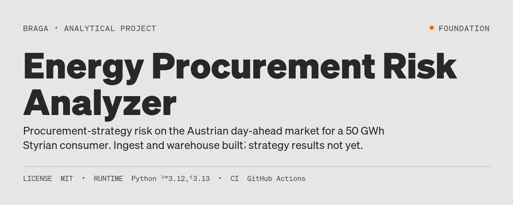
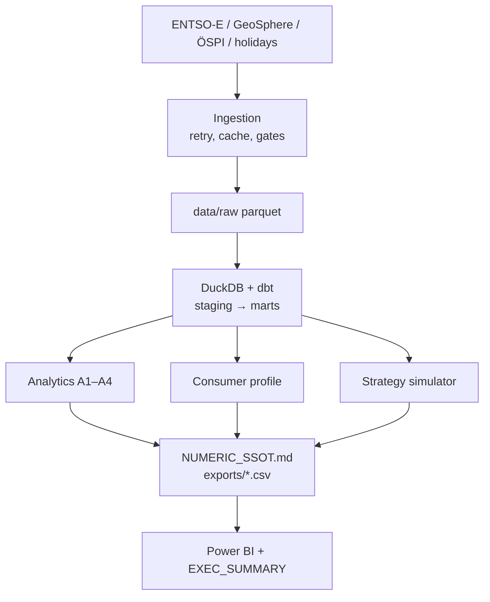

# Energy Procurement Risk Analyzer (EPRA)



[](https://github.com/RafaelBraga-Kribitz/energy-procurement-risk-analyzer/actions/workflows/ci.yml)
[](https://www.python.org/downloads/release/python-3120/)
[](LICENSE)
[](#status)

**Status:** Foundation

After the 2021–2023 European energy crisis, electricity procurement became a board-level
risk for Austrian industry. This project quantifies that risk on the Austrian day-ahead
market (ENTSO-E) for a 50 GWh Styrian industrial consumer — full spot vs. indexed contract
vs. fixed annual price vs. partial hedge.

> **How much did buying electricity the wrong way cost a 50 GWh/year Styrian
> manufacturer in 2021–2025 — and what is the P95 cost exposure for the next
> 12 months under each procurement strategy?**


```mermaid
flowchart TD
    SRC["ENTSO-E / GeoSphere / ÖSPI / holidays"] --> ING["Ingestion<br/>retry, cache, gates"]
    ING --> RAW["data/raw parquet"]
    RAW --> WH["DuckDB + dbt<br/>staging → marts"]
    WH --> A["Analytics A1–A4"]
    WH --> P["Consumer profile"]
    WH --> S["Strategy simulator"]
    A --> SSOT["NUMERIC_SSOT.md<br/>exports/*.csv"]
    P --> SSOT
    S --> SSOT
    SSOT --> RPT["Power BI + EXEC_SUMMARY"]
```

## Status

Foundation: charter and eight SPECs are final. M0 (bootstrap), M1 (ENTSO-E ingest),
M2 (GeoSphere, ÖSPI, calendar), and M3 (DuckDB + dbt warehouse) are implemented.
M4–M7 — consumer profile, market analytics, strategy simulator, and reporting — are
not yet implemented. `make profile`, `make analyze`, `make simulate`, and `make ssot`
still fail loudly with their milestone. The ingested data does not yet reach the
latest complete month (see [Data](#data)).

**No results yet.** Per project rule (RP-601 / GV-303), every number in this README
is copied from the auto-generated `reports/NUMERIC_SSOT.md` (generated at M6; not yet in the repository)
with its epistemic tag. No results exist yet, so none are quoted yet. The answer
lands here at M6/M7. There is no result chart to embed; the pipeline diagram above
is the primary evidence until SSOT numbers exist.

Build order and per-milestone gates: [PROJECT_CHARTER.md](PROJECT_CHARTER.md) §7,
[AGENTS.md](AGENTS.md), [docs/BUILD_LOG.md](docs/BUILD_LOG.md). Implementers start at
[docs/EXECUTION_BLUEPRINT/00_MASTER_PLAN.md](docs/EXECUTION_BLUEPRINT/00_MASTER_PLAN.md).

Governance is deliberately light ([SPEC-08](docs/SPEC-08_governance_quality.md)): three
mechanisms — epistemic tags, append-only ADRs, and an SSOT numeric table gated by CI
(when M6 lands) — plus the load-bearing [`LIMITATIONS.md`](LIMITATIONS.md). No
audit-finding registry.

## Explore this project

| Audience | Start here |
|---|---|
| Recruiter | This page: the question, foundation [Status](#status), and pipeline diagram |
| Hiring manager | [PROJECT_CHARTER.md](PROJECT_CHARTER.md) §1 (question + four strategies) and [LIMITATIONS.md](LIMITATIONS.md) |
| Technical reviewer | [Architecture](#architecture), [Method](#method), [docs/SPEC-01](docs/SPEC-01_data_ingestion.md) through [SPEC-05](docs/SPEC-05_strategy_simulator.md) |
| Auditor | [Data](#data), [Validation](#validation), [docs/SPEC-08](docs/SPEC-08_governance_quality.md), [docs/ADR/](docs/ADR/) |

## What is real vs. modeled

| Tag | Meaning | Applies to |
|-----|---------|-----------|
| VERIFIED | Computed from real external data, no modeling assumptions beyond unit conversion/aggregation | Spot prices, negative-hour counts, AT–DE spread |
| CALIBRATED | Derived via documented assumptions anchored to real data | Consumer load profile, ÖSPI→EUR/MWh translation, strategy costs |
| SIMULATED | Output of a seeded stochastic procedure | Bootstrap cost distributions (P95, CVaR95) |

## Method

Question → evidence → assumptions → model → uncertainty → decision.

1. **Question.** Four strategies on one constructed Styrian load (annual volume set in
   [`config/consumer_profile.yaml`](config/consumer_profile.yaml)): what did each cost
   in the retrospective years, and what is next-12-month P95 / CVaR95 (SPEC-05).
2. **Evidence.** Real Austrian day-ahead prices, load, and generation from ENTSO-E;
   ÖSPI monthly index (hand-transcribed, double-entry); Graz daily temperature; Austrian
   / Styrian holidays. No synthetic market prices.
3. **Assumptions.** Load shape is constructed, not measured (CALIBRATED). ÖSPI proxies
   contract / forward prices (R-5). Grid fees, taxes, and levies are out of scope.
4. **Model.** Ingest → hourly warehouse → load profile → four strategy cost engines →
   block-bootstrap forward risk (seeded). No price forecast (Charter O-1).
5. **Uncertainty.** Bootstrap distributions (SIMULATED) plus documented sensitivities
   (load shape, fixed-price premium). A regime with no historical precedent is outside
   the model.
6. **Decision.** At M6/M7 the SSOT names the euro gap between worst and best strategy
   and the cost of buying down tail risk. That output does not exist yet.

## Validation

Ingestion and warehouse gates exist so a plausible-looking parquet cannot pass silently.
Empty input fails (no vacuous pass). Out-of-range values trigger investigation, not
widened bands (A-2).

| Layer | What it catches |
|---|---|
| SPEC-01 ingest gates | Hour coverage and DST 23/25, price/load plausibility, AT–DE join, negative-price presence, GeoSphere / ÖSPI / calendar gates |
| SPEC-02 dbt tests | Mart schema contract, DST adjacency, 2022-08 price reconciliation, month-spine gaps |
| SPEC-03 (M4, not built) | Golden annual-sum test against the volume in `config/consumer_profile.yaml`; `flat_baseload` shape sensitivity |
| SPEC-05 (M6, not built) | Golden metrics, sanity relations ST-602, seeded bootstrap reproducibility |
| SPEC-08 SSOT check (M6) | README/exec numbers must appear in `NUMERIC_SSOT.md` |

CI today: lint, `pytest -m "not live"`, and a network-free dbt build against a fixture
warehouse. Strategy recovery against known truth is a M6 gate, not a current claim.

## Results

Not yet produced. The annual strategy-cost matrix and the forward-risk table are
generated into `reports/NUMERIC_SSOT.md` at M6 and quoted here from it.

## Dashboard

Not yet built. The Power BI dashboard is an M7 deliverable built by hand from the
exported CSVs; build instructions live in [`dashboards/README.md`](dashboards/README.md).

## Reproduce

Requires Python 3.12, `uv`, and an ENTSO-E API token (env var `ENTSOE_API_TOKEN` only).

```bash
git clone https://github.com/RafaelBraga-Kribitz/energy-procurement-risk-analyzer.git && cd energy-procurement-risk-analyzer
cp .env.example .env       # add ENTSOE_API_TOKEN (SPEC-01 §2)
make setup
make backfill              # ENTSO-E, 2019 → latest complete month
make all
```

`make all` is the intended end-to-end path (transform → profile → analyze → simulate →
ssot → export → report). Today it gets no further than `transform` (M3 `dbt build`) and
then stops with a loud error at `profile`, because M4 is not implemented. `make backfill`
covers ENTSO-E only: run `make geosphere` and `make calendar` before `make all` (the
reconciled ÖSPI CSV is committed), check the gates with `make validate-ingest`, and use
`make warehouse` for the warehouse build report. Expected artifact once M6 lands:
`reports/NUMERIC_SSOT.md`.

## Architecture

Same pipeline as the diagram at the top of this page.

```
ENTSO-E / GeoSphere / ÖSPI(manual) / holidays
        │  ingestion (SPEC-01: retry, cache, validation gates)
        ▼
 data/raw parquet ──► DuckDB + dbt (SPEC-02: staging → marts)
        │
        ├─► analytics A1–A4 (SPEC-04) ──► reports/analytics/
        ├─► consumer profile (SPEC-03) ─┐
        └─► strategy simulator (SPEC-05)┴─► NUMERIC_SSOT.md / exports/*.csv
                                             │
                                             └─► Power BI + EXEC_SUMMARY (SPEC-06)
```

Module import law and milestone graph: [docs/EXECUTION_BLUEPRINT/04_DEPENDENCIES.md](docs/EXECUTION_BLUEPRINT/04_DEPENDENCIES.md).

## Repository structure

| Path | Responsibility |
|---|---|
| `PROJECT_CHARTER.md` | Scope, questions, acceptance |
| `config/` | Non-secret tunables (settings, load, strategies) |
| `src/epra/ingest/` | ENTSO-E, GeoSphere, ÖSPI, calendar, gates |
| `src/epra/warehouse/` | Warehouse build report (M3; layout addition per ADR-013) |
| `src/epra/consumer/` | Load profile (M4 stub) |
| `src/epra/analytics/` | Market analytics A1–A4 (M5 stubs) |
| `src/epra/strategies/` | Retrospective + forward risk (M6 stubs) |
| `dbt/` | Staging and marts on DuckDB |
| `reports/` | Ingestion/warehouse reports; SSOT lands here at M6 |
| `docs/` | SPEC-01…08, ADRs, execution blueprint |
| `tests/` | Contract, unit, and (later) golden tests |

| Technology | Role |
|---|---|
| Python 3.12 + uv | Runtime and lockfile (`uv.lock`) |
| DuckDB + dbt | Analytical warehouse |
| pandas / pyarrow | Ingest and strategy engines |
| matplotlib | Executive charts at M7 (no results yet) |
| GitHub Actions | Lint, tests, fixture `dbt build` |

## Data

Sources (all VERIFIED at the ingest boundary):

- [ENTSO-E Transparency Platform](https://transparency.entsoe.eu) — AT/DE-LU day-ahead
  prices, AT load and generation
- [Austrian Energy Agency — ÖSPI](https://www.energyagency.at/fakten/strompreisindex) —
  monthly wholesale price index, double-entry transcription
- [GeoSphere Austria Data Hub](https://data.hub.geosphere.at) — daily mean temperature,
  Graz
- `holidays` Python package — Austrian / Styrian holidays

Reference load profile is constructed (CALIBRATED), not measured; construction rules in
[SPEC-03](docs/SPEC-03_consumer_load_profile.md). Specified window: 2019-01-01 → latest
complete month; retrospective years are set in
[`config/strategies.yaml`](config/strategies.yaml).

**Current data horizon (not yet the specified window).** The ingested ENTSO-E prices
end in 2024-02 and the GeoSphere temperature series ends in 2023-12
([validation report](reports/ingestion/validation_2026-07-23.md)); the ÖSPI series is
transcribed through 2026-08. A re-backfill to the latest complete month is outstanding
and needs the maintainer's ENTSO-E token. Details: [`LIMITATIONS.md`](LIMITATIONS.md) §6.

## Limitations

What this work does not establish, and what would change the conclusion, is kept in one
place: [`LIMITATIONS.md`](LIMITATIONS.md) (constructed load, ÖSPI as contract proxy,
fixed-price premium assumption, bootstrap limits, excluded grid fees and taxes, data
caveats, no forecast-skill claim).

## Future work

Parking spot for ideas outside the Charter scope (AGENTS.md A-3), one line each.
Nothing is parked yet.

## License

MIT. See [LICENSE](LICENSE).

## Author

<table>
  <tr>
    <td width="110">
      
    </td>
    <td>
      <strong>Rafael Braga-Kribitz</strong><br />
      Seiersberg-Pirka, Austria · Portfolio project, 2026<br />
      <a href="https://www.linkedin.com/in/rafaelbragakribitz/">LinkedIn</a>
      ·
      <a href="mailto:rafaelbragakribitz@gmail.com">rafaelbragakribitz@gmail.com</a>
    </td>
  </tr>
</table>
