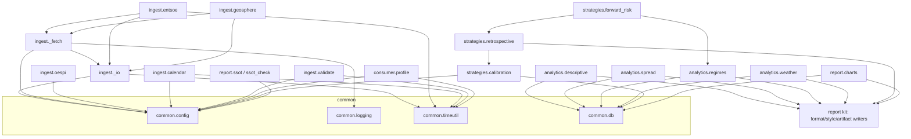
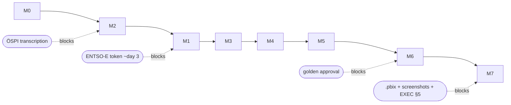
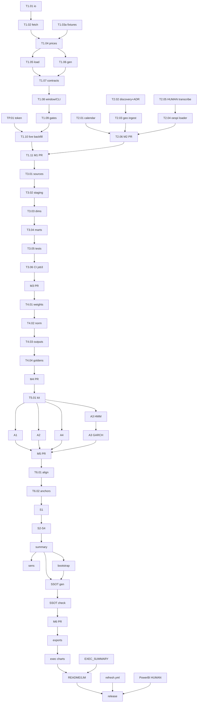

# 04 — DEPENDENCY GRAPHS, CRITICAL PATH, PARALLELISM

## 4.1 Module dependency graph (import-level; arrows = "may import")

**Import law (enforced by review, testable via grep):** `common` imports nothing
from epra; `ingest` never imports analytics/strategies/report; `analytics` and
`strategies` never import `ingest` (marts are the only interface — DM/AN
preambles); only `strategies.forward_risk` may consume A3 regime output (as a
mart/parquet, not a Python import of the module — the arrow above is data-level).
Circular imports are structurally impossible if this law holds.

## 4.2 Milestone dependency graph

Merge order is M2 before M1 (Charter R-1 sanction); everything downstream of M3
depends on real warehouse data and merges strictly sequentially.

## 4.3 Execution dependency graph (task level, abridged to decision-relevant edges)

## 4.4 Critical path

`TP.01 → T1.10` joins the code path `T1.01→T1.02→T1.04→(T1.05/06)→T1.07→T1.08→T1.09`;
thereafter strictly `M2-PR → M1-PR → T3.01→…→M3-PR → T4.01→…→M4-PR → T5.01→T5.05
→M5-PR → T6.01→T6.02→T6.03→T6.04→T6.05→T6.07→T6.08→T6.09→M6-PR → T7.01→T7.02→
T7.04→T7.07`. Everything else hangs off this spine. Budget along the spine
(Charter §7): ~11.5 focused days.

**Slack exploitation:** the ~3-day token wait covers T2.* entirely plus
T1.01–T1.09 development — the critical path resumes with zero idle time at
token arrival (Phase W in [01_PHASES.md](01_PHASES.md)).

## 4.5 Parallel lanes (safe to run concurrently, different agents)

| Window | Lane A | Lane B | Lane C |
|--------|--------|--------|--------|
| Token wait | T1.01→T1.02→T1.04 chain | T2.01 calendar; T2.02→T2.03 geosphere | T2.04 loader (synthetic-CSV tests); human does T2.05 |
| Post-M3 | T4.01→… (critical) | — (M4 is short; don't split) | — |
| Post-T5.01 | T5.02 (A1) | T5.03 (A2) + T5.04 (A4) | T5.05→T5.06 (A3) |
| Post-T6.05 | T6.07 bootstrap | T6.06 sensitivities | T6.09 checker design (against SSOT draft from T6.08 skeleton) |
| M7 | T7.02 charts | T7.05 refresh.yml | T7.03 EXEC (human+agent), T7.06 (human) |

Coordination rule for parallel agents: shared files (`validate.py`, report kit)
are owned by ONE lane per window (owner listed first above); the other lane
stacks a branch on the owner's branch rather than editing concurrently.

## 4.6 Blocked / risky / API-dependent work

- **Token-blocked (only):** TP.01, T1.03b, T1.10 — and transitively every merge
  from M1-PR onward. Nothing else touches the live API.
- **Human-blocked:** T2.05 (ÖSPI), T6.10 golden approval, T7.03 §5, T7.06 (.pbix).
- **Risky (see [12_RISK_REGISTER.md](12_RISK_REGISTER.md)):** T1.02/T1.04
  (entsoe-py RawClient behavior drift — RB-9), T3.01 (dbt-duckdb schema naming —
  RB-10), T5.05 (HMM platform determinism — RB-11), T6.07 (bootstrap
  correctness — highest scientific risk), T1.10 (real-data gate surprises — R-8).
- **Non-API work to finish before the token arrives (checklist):**
  T2.01–T2.04 ✚ T1.01, T1.02, T1.03a, T1.04–T1.09 ✚ ADRs for SG-01, SG-02,
  SG-04, SG-10 ✚ optionally T3.01–T3.02 on a stacked branch against fixtures.
